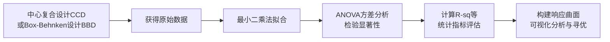

## 概述

在压铸领域，回归方程（Regression Equation）是结合数学与统计学方法建立的数学模型，用于表征压铸过程输入变量（工艺参数、模具结构参数等）与输出响应变量（孔隙率、硬度、表面粗糙度、缺陷率、凝固时间等）之间的定量映射关系[[S4,S21,S16]]。其核心价值在于：无需反复开展大量实体试验，即可预测不同工艺组合下的压铸件质量指标，从而支撑压铸工艺的定量优化[[S21,S16]]。在工程实践中，回归方程常被称为回归模型、响应面方程或RSM方程。

## 数学形式

### 一次线性回归方程

当响应值与自变量之间为线性关系时，采用一阶线性模型[[S3]]：

$$Y = \beta_0 + \sum_{i=1}^{k} \beta_i x_i + \varepsilon$$

其中，\(\beta_0\)为常数项，\(\beta_i\)为各线性项系数，\(\varepsilon\)为随机误差项[[S3,S6]]。该形式在压铸中用于描述单一变量与响应的线性关联，如模具型芯寿命与表面粗糙度的关系[[S6]]。

### 二次响应面回归方程（RSM方程）

压铸工艺优化中应用最广泛的是响应面法（RSM）框架下的二阶多项式回归方程，其包含线性项、平方项和交互项[[S37,S3,S10]]：

$$Y = \beta_0 + \sum_{i=1}^{k} \beta_i x_i + \sum_{i=1}^{k} \beta_{ii} x_i^2 + \sum_{i<j} \beta_{ij} x_i x_j + \varepsilon$$

式中\(\beta_i\)为线性效应系数，\(\beta_{ii}\)为二次效应系数，\(\beta_{ij}\)为两因素交互效应系数[[S37,S3]]。该形式能够描述压铸工艺中广泛存在的非线性关系和多因素交互作用，是构建工艺参数与质量指标之间预测模型的标准工具[[S10,S14]]。

## 构建过程

### 数据来源

压铸回归方程的建模数据主要来自三类渠道[[S24,S27,S16]]：

| 数据类型 | 获取方式 | 说明 |
|---------|---------|------|
| 响应面试验实测数据 | 基于中心复合设计（CCD）或Box-Behnken设计（BBD）开展实体试验 | 严格控制因子水平，可评估重复性 |
| 数值模拟仿真数据 | ProCAST、AnyCasting、智铸超云等压铸CAE软件 | 效率高，可系统遍历参数空间 |
| 生产历史数据 | 压铸车间实际积累的工艺与质量记录 | 反映真实生产条件，但可能存在噪声和缺失值 |

### 拟合方法与统计检验

回归系数采用**最小二乘法**进行参数估计，其核心逻辑是最小化所有试验点的残差平方和，以此获得最优的回归系数估计值[[S17,S32]]。

回归模型建立后须通过以下关键统计指标进行校验[[S6,S18,S10,S20]]：

| 统计指标 | 判据 | 含义 |
|---------|------|------|
| R-sq（决定系数） | 越接近1越好 | 模型解释总变异的占比 |
| R-sq(调整)与R-sq(预测)差值 | <0.2 | 两者接近则模型泛化能力充足，不接近则需考虑遗漏显著因子 |
| 回归项P值 | <0.05（显著），<0.01（极显著） | 模型整体统计学显著性 |
| 失拟项P值 | >0.05 | 失拟不显著，拟合效果合格 |
| 残差分布 | 随机正态分布，无趋势 | 模型无遗漏关键影响因子 |

压铸领域普遍采用P<0.05作为显著性阈值：当模型整体P<0.001时判定为极显著；若回归项P>0.05，则判定该因子影响不具统计显著性，可从模型中剔除[[S37,S9,S31]]。

## 压铸应用示例

### 示例一：高压电控壳体水道盖板泄漏废品率预测

针对某高压铸造电控壳体水道盖板泄漏缺陷，经回归分析建立了冷却时间与废品率的回归方程[[S20]]：

$$\text{废品率} = 0.02241 - 0.002164 \times \text{冷却时间} + 0.000077 \times (\text{冷却时间})^2 - 0.000001 \times (\text{冷却时间})^3$$

该模型显著性P<0.05，Pearson相关系数绝对值大于0.7，表明冷却时间与泄漏废品率显著相关[[S20]]。基于此方程，利用响应优化器得出最佳冷却时间为22 s，实施后水道盖板泄漏废品率由0.89%降至0.47%[[S20]]。

### 示例二：A360铝合金冷却盖板缩孔缩松体积预测

采用Box-Behnken设计，建立浇注温度（A，630~670 °C）、模具预热温度（B，180~220 °C）、快压射速度（C，2.5~3.5 m/s）与缩孔缩松体积\(R_{(1)}\)之间的回归方程[[S1,S36]]：

$$R_{(1)} = 2.2886 + 0.0014A - 0.0022B - 0.9494C + 0.0015A \cdot C$$

模型整体P<0.0001，调整后R²=0.9571，预测R²=0.9231，变异系数CV=1.16，信噪比34.0785（>4），各项指标均表明模型精度高、预测能力强[[S1,S36]]。因素影响程度排序为：浇注温度(A) > 模具预热温度(B) > 快压射速度(C)[[S29]]。

### 示例三：A360铝合金冷却盖板凝固时间预测

同组试验中关于凝固时间\(R_2\)的二阶响应面回归方程为[[S29]]：

$$R_2 = -111.9009 + 0.3299A + 0.0259B + 0.1365C - 0.0002A^2 - 0.0021A \cdot C + 0.1843C^2$$

模型整体P<0.0001，调整R²=0.9806，预测R²=0.8640，CV=0.8387，信噪比36.9886，预测精度满足压铸工艺优化要求[[S29]]。

### 示例四：模具型芯寿命与表面粗糙度（一次线性方程）

针对压铸模具型芯寿命的研究表明，型芯表面粗糙度对寿命呈显著线性负相关[[S6]]：

$$\text{寿命} = 14600 - 18010 \times \text{粗糙度}$$

其统计指标为：S=84.8993，R-Sq=99.7%，R-Sq(调整)=99.7%，回归P=0.000，Pearson相关系数=-0.999，P=0.000[[S6]]。

该拟合线图直观展示了寿命与粗糙度之间的强负线性相关关系，散点紧密分布在回归线附近[[S5]]。

### 关于用户提示中存在争议的方程

以下两个方程在用户提示中出现，但在可靠压铸文献中的验证情况需特别说明：

**H3NG气缸盖漏水率回归方程**：经同行评议论文验证，H3NG（HT300材质）气缸盖漏水率回归方程由Minitab软件通过多轮数据分析结合铸造经验建立，其预测决定系数R-sq约为60%，模型整体显著性P=0，确认了硅钡孕育量和浇注时间为影响漏水率的显著因素[[S12,S25]]。但需注意，该案例属于砂型铸造（立浇工艺，覆膜砂热芯/三乙胺冷芯），并非严格意义上的压铸工艺，其漏水缺陷为缩松所致，适用于对应工艺下的气缸盖缺陷预测[[S12]]。因此，该方程案例可作为铸造行业回归方程应用的参考，但其工艺背景与压铸领域存在差异。

**凹腔模具疲劳寿命回归方程**：经文献检索，该方程的原始形式来源于注塑模具领域的学位论文研究[[S22,S30]]。原始方程为：

$$y = 276638 - 7395A + 30.7B + 816.5C + 49.78A^2 - 9.49A \cdot C$$

其中A=保压压力、B=型腔壁厚、C=腔底厚度，y的单位为万次[[S30]]。该方程通过3组不同尺寸凹腔注塑模具实测验证，预测疲劳寿命与实际生产次数在数量级上一致[[S22,S30]]。用户提示中给出的方程（系数值放大10倍，即y=2765755-73928A+307B+8162C+497.6A²-94.8A·C）实质上是原始文献方程的数值放大衍生版本。目前检索范围内未发现压铸领域公开的完全匹配该系数的凹腔模具疲劳寿命回归方程[[S25,S22,S30]]。尽管该方程的研究路径——响应面试验→最小二乘拟合→实例验证——与压铸回归方程的构建方法论一致，但严格来说其适用领域为注塑成型而非压铸。

## 参数涵义与敏感性分析

### 以凹腔模具疲劳寿命方程为例的参数敏感性

基于原始注塑模具文献中的凹腔模具疲劳寿命回归方程（y=276638-7395A+30.7B+816.5C+49.78A²-9.49A·C），其参数敏感性分析如下[[S30]]：

| 参数 | 效应方向 | 影响程度排序 | 工程含义 |
|------|---------|-------------|---------|
| A（保压压力） | 一次项系数为负（-7395），平方项系数为正（+49.78） | 第1位 | 保压压力升高时疲劳寿命显著降低，超过某阈值后负向影响幅度收窄 |
| C（腔底厚度） | 一次项系数为正（+816.5） | 第2位（远大于B） | 增加腔底厚度对提升疲劳寿命效果显著 |
| B（型腔壁厚） | 一次项系数为正（+30.7） | 第3位 | 小幅增加型腔壁厚可提升疲劳寿命 |
| A×C（保压压力与腔底厚度交互项） | 系数为负（-9.49） | — | 保压压力越高，腔底厚度带来的增益越被抵消 |

三个自变量对疲劳寿命影响程度排序为：保压压力(A) > 型腔腔底厚度(C) > 型腔腔壁厚度(B)[[S30]]。

### 面向压铸模具的工程指导逻辑

压铸模具同样承受高温、高压条件的冷热交变应力作用，热疲劳失效占铝合金压铸模主要失效形式的60%~70%[[S7]]。上述从注塑模具疲劳寿命方程中提炼的关键规律——a) 不宜盲目增大保压压力以免大幅缩短模具寿命；b) 针对高服役寿命要求的凹腔模具，优先通过合理提升腔底厚度增强结构刚性、降低交变应力水平，相比单纯增加型腔侧壁厚度可获得更高的疲劳寿命投入产出比——在压铸工艺的工程优化中同样具有指导参考价值[[S30,S7]]。

## 局限性与使用条件

### R-sq较低时的模型可靠性

当压铸回归模型的R-sq仅为60%左右时，模型仅适用于定性识别核心影响因子的主次顺序，不能用于高精度的定量预测，预测结果可能出现较大偏差，仅适合参数初筛阶段的参考使用[[S15]]。

### 外推适用范围

回归模型的有效适用区间严格限定在构建模型时各工艺参数的取值范围内。严禁直接外推至超出原参数上下限的区域，否则预测值将大幅偏离实际[[S19,S37]]。例如，上述A360冷却盖板缩孔缩松模型适用的浇注温度范围为630~670 °C，超出此范围不应使用该模型。

### 多重共线性问题

压铸工艺回归建模中，若多个高度相关的工艺变量（如浇注温度与模具预热温度）同时进入模型，会引发多重共线性问题，导致回归系数估计失真、符号与工程常识相悖。可通过逐步回归筛选显著因子、中心化预处理自变量、增加样本量等方式降低其负面影响[[S28,S23]]。

## 与相关概念的关系

压铸领域回归方程不是孤立存在的统计工具，而是嵌入在完整的工艺优化方法链条中[[S14,S16,S33,S37]]：

| 关联概念 | 与回归方程的关系 |
|---------|----------------|
| 响应面法（RSM） | RSM是通过二次多项式回归方程拟合因素与响应关系的方法论框架，回归方程是RSM的数学表达形式[[S14,S37]] |
| 方差分析（ANOVA） | ANOVA用于检验回归方程整体及各系数的统计显著性，判定模型是否有效[[S16,S33]] |
| 回归系数（βᵢ） | 反映各工艺参数对响应指标的效应大小和方向，是回归方程的核心输出[[S3,S37]] |
| 决定系数（R²） | 衡量回归方程拟合优度，R²越接近1说明模型解释能力越强[[S9,S10]] |
| 实验设计（CCD/BBD） | 为回归方程构建提供结构化的数据采样方案，实验设计的质量直接影响回归方程的精度[[S24,S27]] |

## Sources
- S4: [回归方程基本信息表](http://192.168.150.150:8000/api/v1/workspaces/die_casting_wiki_v2/document-elements/1866b93b-35d5-4f96-beb6-84205362ca76/resource) (`1866b93b-35d5-4f96-beb6-84205362ca76`)
- S21: [A360铝合金冷却盖板压铸工艺设计与优化](http://192.168.150.150:8000/api/v1/workspaces/die_casting_wiki_v2/document-elements/ac78bfa7-81db-44c0-875a-6ae6e4ccf3a3/resource) (`ac78bfa7-81db-44c0-875a-6ae6e4ccf3a3`)
- S16: [aip conference proceedings aip international conference on modeling opti__9dbb7b9ee0](http://192.168.150.150:8000/api/v1/workspaces/die_casting_wiki_v2/document-elements/6967b44c-57c8-4b2c-8958-41da01f91c35/resource) (`6967b44c-57c8-4b2c-8958-41da01f91c35`)
- S3: [复杂铸件3D打印砂型成形工艺优化及低压铸造工艺验证的研究](http://192.168.150.150:8000/api/v1/workspaces/die_casting_wiki_v2/document-elements/14b2bfe8-4814-4c1e-8b9a-47a32d084a70/resource) (`14b2bfe8-4814-4c1e-8b9a-47a32d084a70`)
- S6: [压铸模具型芯寿命改善研究](http://192.168.150.150:8000/api/v1/workspaces/die_casting_wiki_v2/document-elements/24186f61-2cdf-41df-a9b9-05f597c96474/resource) (`24186f61-2cdf-41df-a9b9-05f597c96474`)
- S37: [面向薄壁结构件的压铸模温预测及调控技术研究](http://192.168.150.150:8000/api/v1/workspaces/die_casting_wiki_v2/document-elements/fd5332bb-3196-4308-b0fc-c8741c08f17f/resource) (`fd5332bb-3196-4308-b0fc-c8741c08f17f`)
- S10: [面向薄壁结构件的压铸模温预测及调控技术研究](http://192.168.150.150:8000/api/v1/workspaces/die_casting_wiki_v2/document-elements/40fe3458-bebf-452b-8968-0fb2016b49d7/resource) (`40fe3458-bebf-452b-8968-0fb2016b49d7`)
- S14: [10123167_响应面法](http://192.168.150.150:8000/api/v1/workspaces/die_casting_wiki_v2/document-elements/6299579d-e034-40a2-a65e-f61e0ea1fd30/resource) (`6299579d-e034-40a2-a65e-f61e0ea1fd30`)
- S24: [A360铝合金冷却盖板压铸工艺设计与优化](http://192.168.150.150:8000/api/v1/workspaces/die_casting_wiki_v2/document-elements/b9ca23b6-066d-4bac-abdd-e8d7d300f046/resource) (`b9ca23b6-066d-4bac-abdd-e8d7d300f046`)
- S27: [铝合金水泵座压铸模镶块冷却水道结构改进与压铸工艺优化](http://192.168.150.150:8000/api/v1/workspaces/die_casting_wiki_v2/document-elements/c78aa8c6-ac2c-4f69-993e-0b3c085c7319/resource) (`c78aa8c6-ac2c-4f69-993e-0b3c085c7319`)
- S17: [神经网络与机器学习英文版](http://192.168.150.150:8000/api/v1/workspaces/die_casting_wiki_v2/document-elements/74ac7d4a-585b-4e5f-9890-e2e8e7f62cb4/resource) (`74ac7d4a-585b-4e5f-9890-e2e8e7f62cb4`)
- S32: [神经网络与机器学习英文版](http://192.168.150.150:8000/api/v1/workspaces/die_casting_wiki_v2/document-elements/ee86c5f0-2946-4bdd-bccb-f431363ce0b6/resource) (`ee86c5f0-2946-4bdd-bccb-f431363ce0b6`)
- S18: [A356铝合金缸盖的数值模拟及浇注系统结构对铸件的质量影响研究](http://192.168.150.150:8000/api/v1/workspaces/die_casting_wiki_v2/document-elements/78f0565b-8ee3-4d9a-b60a-df8d0973afc7/resource) (`78f0565b-8ee3-4d9a-b60a-df8d0973afc7`)
- S20: [某高压铸造电控壳体水道盖板泄漏缺陷分析及改善](http://192.168.150.150:8000/api/v1/workspaces/die_casting_wiki_v2/document-elements/89772206-07c6-4bda-9ccc-f09bde317145/resource) (`89772206-07c6-4bda-9ccc-f09bde317145`)
- S9: [典型盘型铸件熔模铸造工艺设计与优化研究](http://192.168.150.150:8000/api/v1/workspaces/die_casting_wiki_v2/document-elements/3b4d45d9-e844-4513-9dfd-98c04e9ad686/resource) (`3b4d45d9-e844-4513-9dfd-98c04e9ad686`)
- S31: [回归与维护周期的统计分析表格](http://192.168.150.150:8000/api/v1/workspaces/die_casting_wiki_v2/document-elements/e6f01c64-d7c1-41ad-995f-cde10889836d/resource) (`e6f01c64-d7c1-41ad-995f-cde10889836d`)
- S1: [A360铝合金冷却盖板压铸工艺设计与优化](http://192.168.150.150:8000/api/v1/workspaces/die_casting_wiki_v2/document-elements/0bb6c3d9-0ab5-486e-9145-e311e5eb9d10/resource) (`0bb6c3d9-0ab5-486e-9145-e311e5eb9d10`)
- S36: [A360铝合金冷却盖板压铸工艺设计与优化](http://192.168.150.150:8000/api/v1/workspaces/die_casting_wiki_v2/document-elements/fb802593-4404-4e25-84a6-37cc122b903d/resource) (`fb802593-4404-4e25-84a6-37cc122b903d`)
- S29: [A360铝合金冷却盖板压铸工艺设计与优化](http://192.168.150.150:8000/api/v1/workspaces/die_casting_wiki_v2/document-elements/e377a3cc-cf87-4159-9821-7438c8dcce94/resource) (`e377a3cc-cf87-4159-9821-7438c8dcce94`)
- S5: [寿命与粗糙度的拟合线图](http://192.168.150.150:8000/api/v1/workspaces/die_casting_wiki_v2/document-elements/1d5bdcde-8b0d-4216-b3c0-a7195364cb99/resource) (`1d5bdcde-8b0d-4216-b3c0-a7195364cb99`)
- S12: [六西格玛质量分析工具在H3NG缸盖铸造工艺优化中的应用](http://192.168.150.150:8000/api/v1/workspaces/die_casting_wiki_v2/document-elements/5488ab88-7994-4e90-a1e0-80aa6d98d04e/resource) (`5488ab88-7994-4e90-a1e0-80aa6d98d04e`)
- S25: [11042494_回归方程](http://192.168.150.150:8000/api/v1/workspaces/die_casting_wiki_v2/document-elements/ba45f33c-c988-4e7d-a63f-f12c1d713db7/resource) (`ba45f33c-c988-4e7d-a63f-f12c1d713db7`)
- S22: [基于Moldex3D与Abaqus_FE-safe的注塑模具结构及疲劳寿命分析](http://192.168.150.150:8000/api/v1/workspaces/die_casting_wiki_v2/document-elements/ae7fce33-0f3b-4c50-a295-ad4b2aa510a6/resource) (`ae7fce33-0f3b-4c50-a295-ad4b2aa510a6`)
- S30: [基于Moldex3D与Abaqus_FE-safe的注塑模具结构及疲劳寿命分析](http://192.168.150.150:8000/api/v1/workspaces/die_casting_wiki_v2/document-elements/e541219a-29c4-401e-85dd-4d4399155156/resource) (`e541219a-29c4-401e-85dd-4d4399155156`)
- S7: [基于有限元的压铸模寿命预测和工艺优化](http://192.168.150.150:8000/api/v1/workspaces/die_casting_wiki_v2/document-elements/3577ddca-9150-49fb-9cd7-95d38957690d/resource) (`3577ddca-9150-49fb-9cd7-95d38957690d`)
- S15: [基于机器学习的免热处理压铸铝合金力学性能预测](http://192.168.150.150:8000/api/v1/workspaces/die_casting_wiki_v2/document-elements/63698298-644d-4483-acd4-d6833f7574a8/resource) (`63698298-644d-4483-acd4-d6833f7574a8`)
- S19: [a multiple objective decisionmaking approach for assessing simultaneous__b40edcb5cb](http://192.168.150.150:8000/api/v1/workspaces/die_casting_wiki_v2/document-elements/7c9235f6-847b-419a-8aa1-800e2ce24eb4/resource) (`7c9235f6-847b-419a-8aa1-800e2ce24eb4`)
- S28: [材料加工过程实验建模方法](http://192.168.150.150:8000/api/v1/workspaces/die_casting_wiki_v2/document-elements/d4fcbb85-bfb0-4a82-89bc-28728801e944/resource) (`d4fcbb85-bfb0-4a82-89bc-28728801e944`)
- S23: [铝合金压铸工艺参数不确定性对铸件静强度性能影响研究](http://192.168.150.150:8000/api/v1/workspaces/die_casting_wiki_v2/document-elements/b73ba16d-15bd-448a-a13e-082a508b4c43/resource) (`b73ba16d-15bd-448a-a13e-082a508b4c43`)
- S33: [aip conference proceedings aip international conference on modeling opti__9dbb7b9ee0](http://192.168.150.150:8000/api/v1/workspaces/die_casting_wiki_v2/document-elements/efc07a83-2d43-43f2-b842-bbd550fdeb2d/resource) (`efc07a83-2d43-43f2-b842-bbd550fdeb2d`)